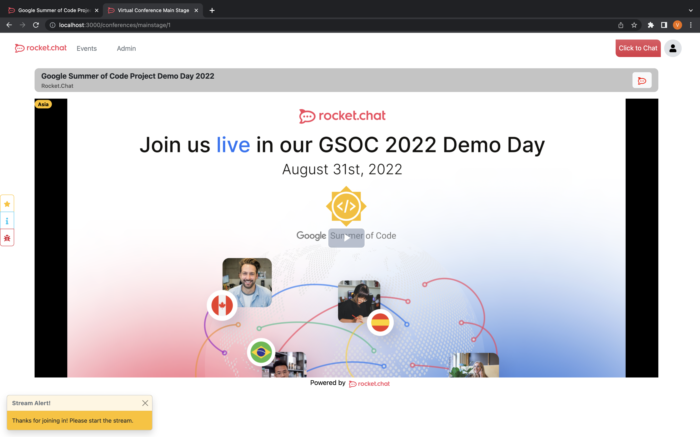
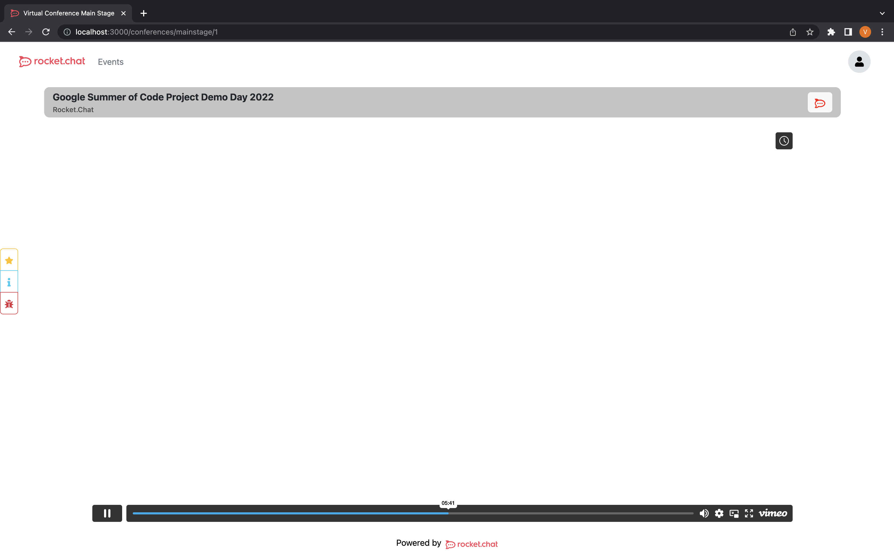

# Day of Event Components

The Day-of-Event Components of RC4Conferences enable efficient virtual conference management, on the Day of Event, Attendees and Speakers interact through the Greenroom and Mainstage page. The Day-of-Event Components, including the Greenroom and Mainstage pages, serve as the main interaction points for Attendees and Speakers during the conference. The platform ensures seamless communication and engagement for a successful event.

## Videostreamer Component

The `Videostreamer` component is a React component that allows you to play either a local video stream, streamed through a local RTMP forest or a Twitch/Vimeo stream, by embedding their respective players onto the website, depending on the value of `service` prop.

## Features

- The component supports video streaming from both local source and Twitch/Vimeo.
- The component has various error and success handling functions.
- The component uses [`video.js`](https://videojs.com/getting-started/) for local video streaming and [Twitch.Embed](https://dev.twitch.tv/docs/embed/everything/)/Iframe for Twitch/Vimeo video streaming.

## State Variables

- `ping`: a boolean state variable that indicates the loading state of the video.
- `message`: a string state variable that contains the message to be displayed in the Toast component.

## Props

- `service`: type string, (either local / twitch or vimeo).
- `src`: type string, the source of the video stream, it can be either the local video source (.m3u8 file) / Twitch username or Vimeo webinar link (See `How to use` for sample formats).
- `poster`: type string, the poster image of the video (required for `service={"local"}` type).
- `type`: type string, the type of the video (required for `service={"local"}` type).
- `region`: type string, the region of the local video server (required for `service={"local"}` type).

## Error and Success Handling

- If the video stream cannot be fetched, the function `handleError` is called.
- If the video stream has to wait for data, the function `handleWait` is called.
- If the video stream stalls, the function `handleStall` is called.
- If the video stream is successfully loaded, the function `handleLoad` is called.
- If the video stream is in progress, the function `handleProgress` is called.

## How to use

```jsx
import { Videostreamer } from "../../../components/conferences/dayOfEvent/mainstage/Videostreamer";

<Videostreamer
  poster={evePoster ? evePoster : "/gsocsmall.jpg"}
  service="local"
  src="streamURL" // in the format of "https://open.rocket.home/stream.m3u8"
  type="application/vnd.apple.mpegurl"
  region={region}
/>

<Videostreamer
  service="twitch"
  src="channelName" // twitch username
/>

<Videostreamer
service="vimeo"
src="webinarLink" // in the format of "https://vimeo.com/webinars/events/{Random-String}/embed"
/>
```

### Note

Note: The embedded player will not load when using the Vimeo RTMP URI (Start Free Demo), as the viewing of that event is private and is limited to your viewing only. In order to broadcast using Vimeo and have that stream be visible to the public, you must subscribe to their premium service. As a result, using the Vimeo Free Demo won't function because the event's viewership is not public

### Preview

<figure align="center" width="100%">
  
  <figcaption>A screenshot of videostream component when using local video stream </figcaption>
</figure>

<figure align="center" width="100%">
  
  <figcaption>A screenshot of videostream component when using vimeo embedded player </figcaption>
</figure>

<figure align="center" width="100%">
  
  <figcaption>A demo of videostream component when using twitch embedded player </figcaption>
</figure>
